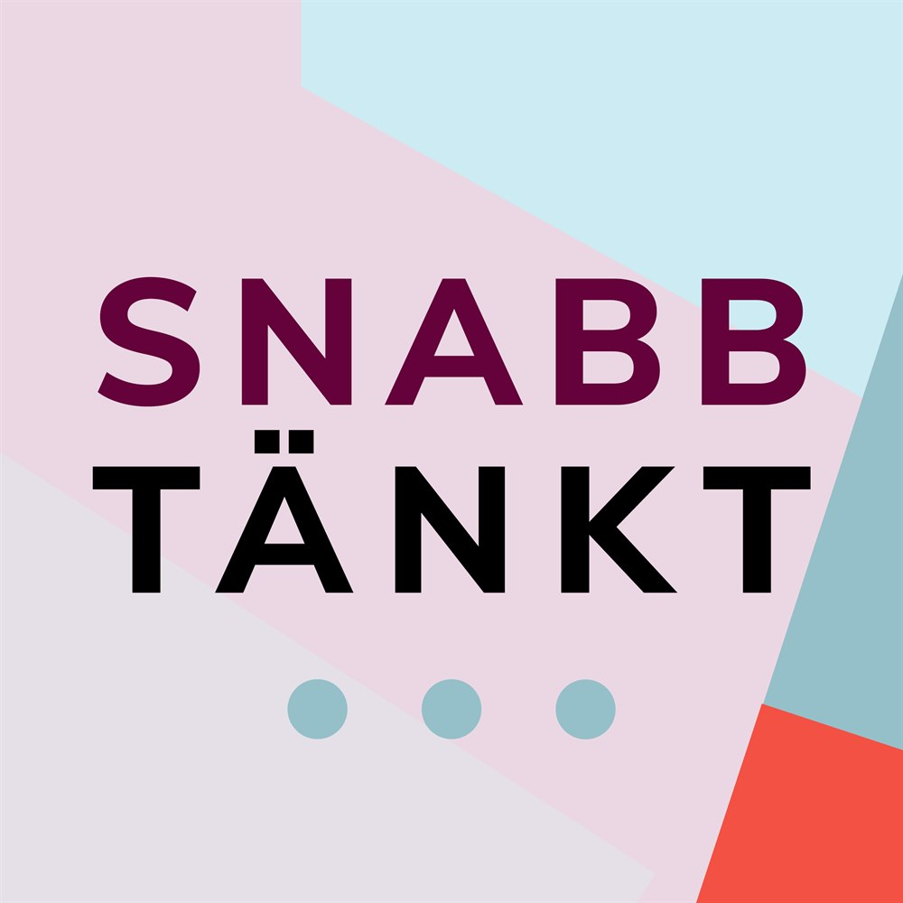

# Snabbtänkt valet 2018 

Vilka nyhetskällor har varit mest framträdande på Twitter inför valet? Det är den övergripande frågeställningen för den här analysen av svensk politik på Twitter, [#svpol](https://twitter.com/search?q=%23svpol&src=tyah), inför riksdagsvalet 2018.

Här hittar du all källkod till min analys i rapporten [Snabbtänkt](https://www.snabbtankt.se/), samt ytterligare analyser av #svpol.

Några frågeställningar (och tillvägagångssätt) i analysen:

- Vilka ord är vanligast? (frekvenstabeller)
- Vilka ordpar är vanligast? (bigram Markov Chain)
- Är orden positivt eller negativt laddade? (sentimentsanalys)
- Vilka nyhetssajter förekommer oftast tillsammans? (nätverksanalys)

## Källkod

- Filen [`R/analysis.rmd`](R/analysis.rmd) innehåller hela den explorativa analysen.
- Filen [`R/create_graph.r`](R/create_graph.r) åsterskapar bilderna i PNG- och PDF-format.
- Filen (`doc/snabbtankt-text.rmd`)(snabbtankt-text.rmd) innehåller rapporttexten och skapar en Word-fil.

## Data, urval och metod

Datan består av Twitterinlägg som innehåller hashtaggen `#svpol`. Man skulle kunna tänka sig att inkludera `#valet2018` och `#val2018`. Men ofta förekom dessa redan i `#svpol` (men inte tvärtom). Dessutom möjliggör en analys av `#svpol` jämförelser mellan 2017 och 2018 för att se förändringar över tid.

Twitterinläggen kan inte offentliggöras här på grund av Twitters licensavtal.

Verktyget [DMI-TCAT](https://wiki.digitalmethods.net/Dmi/ToolDmiTcat) har använts för att samla in twitterinlägg. Urvalet är nästintill komplett tack vare att insamlingen skett via flera Twitterkonton vilket undviker vanliga begränsningar (API [rate limiting](https://developer.twitter.com/en/docs/basics/rate-limiting.html)). En serverkrasch gjorde dock att inlägg saknas 2018-05-07 till 2018-06-03.

## Vad är Snabbtänkt?

[Snabbtänkt](https://www.snabbtankt.se/) är ett forskningssamarbete mellan nästan hundra forskare och innehåller

> reflektioner från den svenska valrörelsen 2018 av ledande forskare där närmare hundra forskare analyserar och reflekterar över årets val och valrörelse. Här kommer du alltså att kunna hitta de bästa analyserna och reflektionerna samlade i en gratis nedladdningsbar rapport 10 dagar efter valet samt i podden Snabbtänkt.

## Inspiration

Här kommer kredd till de som inspirerat dessa analyser.

- [David Robinson](http://varianceexplained.org/r/hn-trends/)
- [Julia Silge](https://github.com/juliasilge/women-in-film)
- [Kate Starbird](https://medium.com/hci-design-at-uw/information-wars-a-window-into-the-alternative-media-ecosystem-a1347f32fd8f)
- [Sara Locatelli](http://www.deeplytrivial.com/2018/08/statistics-sunday-getting-started-with.html)