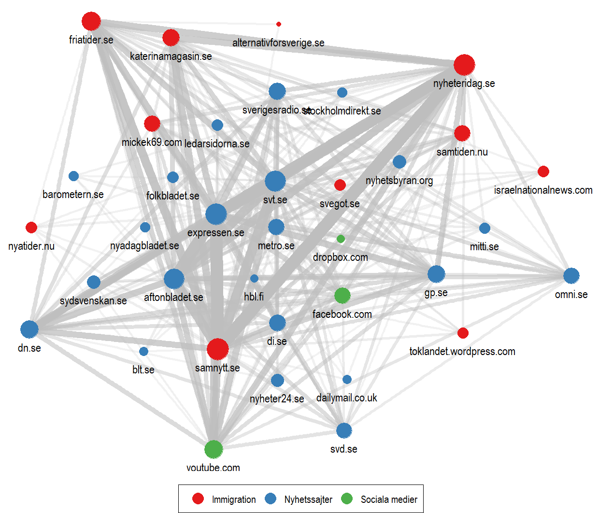
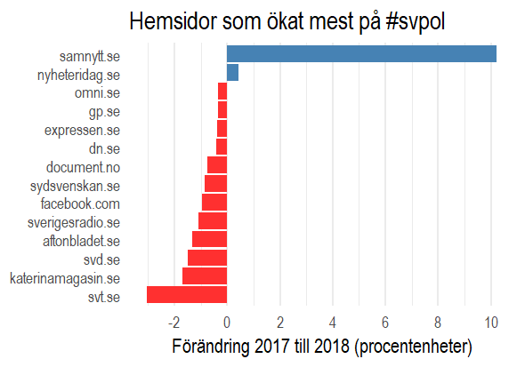

I bild 1 syns hemsidor som är associerade med varandra från hashtaggen #svpol. Ju större bubbla, desto fler länkar till hemsidan, och linjernas tjocklek visar hemsidorna som förekommer mest tillsammans bland användarnas inlägg. De flesta användarna tenderar med andra ord att länka till traditionella massmedier (i synnerhet expressen.se), men hemsidor om immigration står för en väldigt stor andel av länkarna.

I bild 2 framgår i stället hur andelen länkar har förändrats jämfört med samma period 2017. Därmed har samnytt.se ökat mest, en hemsida som står närmast Sverigedemokraterna ideologiskt. Enligt [Försvarets forskningsinstitut](https://www.foi.se/press--nyheter/nyheter/nyhetsarkiv/2018-08-29-antalet-botar-pa-twitter-okar-infor-valet.html) beror ökningen till stor del på konton som automatiskt postar länkar till hemsidan. Detta visar att om man vill läsa om politik på #svpol får man vara beredd på mycket ensidiga perspektiv.

Hela analysen finns på <https://github.com/peterdalle/snabbtankt-valet2018>.